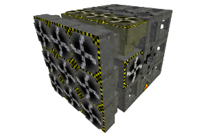

# Modular Tunnel Boring Machine
## aka The Almighty Digtron

**More examples: [Digtron Luanti Forum Topic](https://forum.luanti.org/viewtopic.php?t=16295)**

This mod contains a set of blocks that can be used to construct highly customizable and
modular tunnel-boring machines, bridge-builders, road-pavers, wall-o-matics, and other
such construction/destruction contraptions.

## Basic functionality

A digging machine's components must be connected to the control block via a path leading
through the faces of the blocks - diagonal connections across edges and corners don't count.

#### Crucial Digtron blocks

* **Digger heads** excavate material in front of them when the machine is triggered.
    * The mined blocks are shunt into the inventory module. Excess is dropped to ground.
* **Builder heads** build a user-configured node in the direction they're facing.
    * Useful for situations where a tunnel-borer intersects a cavern.
* **Inventory modules** hold material produced by the digger and provide material to the builders.
* **Fuel modules** hold flammable materials to feed the beast.
* **Control blocks** trigger the machine and move it in a particular direction.
    * The auto-controller triggers automatically for a custom number of cycles.

Builder heads can be set to construct their target block "intermittently", allowing
for regularly-spaced structures to be constructed. Common uses include building support
arches at regular intervals in a tunnel, adding a torch on the wall at regular
intervals, laying rails with regularly-spaced powered rails interspersed, and adding
stairs to vertical shafts.

A player can ride their Digtron as it goes.

#### Other specialized Digtron blocks

* **"Axle" block**: allows an assembled Digtron to be rotated into new orientations without needing to be rebuilt block-by-block
* **Crate**: stores an assembled Digtron and allows the player to transport it to a new location
* **Duplicator**: creates a copy of an existing Digtron (if provided with enough spare parts)
* **Item ejector**: moves excavated materials from a Digtron's inventory into pipeworks tubes.
* **Light**: can be mounted on a Digtron to illuminate the workspace as it moves
* Structural components to make it look cool

## License

* Code: MIT
* Textures: CC-BY-SA 3.0
* Sounds: CC BY 3.0 / CC 1.0 ([sounds/license.txt](sounds/license.txt))

See also: [LICENSE.txt](LICENSE.txt).

## Dependencies

#### Mandatory

* Luanti/Minetest >= 5.5.0
* `default` mod (from Minetest Game or compatible games)
* [fakelib](https://content.luanti.org/packages/OgelGames/fakelib/)

#### Optional

* [doc](https://forum.luanti.org/viewtopic.php?t=15912), an in-game documentation mod.
  Detailed documentation for all of the Digtron's individual blocks are included as
  well as pages of general concepts and design tips.
   * Note: The mods `doc` and `doc_items` should be enabled for the best experience.
* [pipeworks](https://forum.luanti.org/viewtopic.php?t=2155) for item transport automation.
* [hopper](https://github.com/minetest-mods/hopper) for item transport automation.
* [awards](https://forum.luanti.org/viewtopic.php?t=4870) to add over 30 Digtron-specific achievements (progression) to the game.
* [technic](https://forum.luanti.org/viewtopic.php?t=2538) to power Digtron with electricity (including batteries!).
* [TechAge](https://forum.luanti.org/viewtopic.php?t=24619), a mod that adds technology stages where the player advances from the water mill and steam engine into future technology. It includes a rechargeable Digtron Battery.
